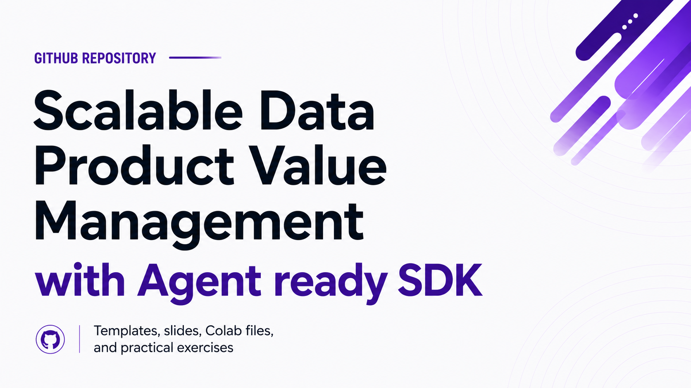

# Open Data Products SDK Course Exercises

This repository contains the hands-on exercise material for a Udemy course on
using the Open Data Products SDK. The course walks through practical SDK
workflows for validating standards files, using vocabulary helpers, configuring
LLM providers, generating data product artifacts, and building reviewable data
product portfolio workspaces.

The course is created by Dr. Jarkko Moilanen, igniter and maintainer of the
Open Data Products Standards family and the Open Data Products SDK.

For course details and enrollment, use this placeholder until the public Udemy
link is added:

[Add Udemy course link here](https://www.udemy.com/)

## Browser Version

This repository also includes a static browser version of the course material.
Open [`html/index.html`](html/index.html) in a browser to read the lessons with
navigation and styling.

## What This Repository Contains

The repository is organized as lesson folders plus Colab notebooks. Each lesson
folder contains a `README.md` with the exercise instructions for that part of
the course. Some lessons also include the input files used by the exercises.

## Lessons

- `06-what-the-sdk-is/` - introduction to the SDK and where it fits in the Open
  Data Products standards family.
- `07-installing-and-running-sdk/` - local SDK installation and first command
  checks.
- `08-validating-and-explaining-standards-files/` - validating and explaining
  ODPS YAML files.
- `09-use-odpv-vocabulary-helpers/` - using vocabulary helper commands.
- `10-working-with-local-llms/` - configuring local LLM providers.
- `11-working-with-online-llm-providers/` - configuring hosted LLM providers.
- `12-generating-odps-data-products/` - generating ODPS data product drafts.
- `13-working-with-generation-and-fragments/` - working with generated
  fragments and generation workflows.
- `14-working-with-odpg-graphs/` - building and inspecting ODPG graph
  relationships.
- `15-working-with-odpc-catalogs/` - creating and reviewing ODPC catalog
  artifacts.
- `16-from-commands-to-portfolio-builder/` - moving from individual commands to
  the portfolio workflow.
- `17-what-the-portfolio-builder-creates/` - understanding the files created by
  the portfolio builder.
- `18-build-first-portfolio-in-colab/` - building the first portfolio in a
  notebook environment.
- `19-update-portfolio-and-review-version-history/` - refreshing portfolio
  material and reviewing version history.
- `20-how-to-localize-portfolio/` - localizing portfolio output.
- `21-final-review-human-view-and-agent-ready-yaml/` - reviewing browser output
  and machine-readable YAML.
- `22-wrap-up-and-next-steps/` - final review and next steps after the course.

## Colab Notebooks

The `Colab/` folder contains notebook versions of the course exercises:

- `Section_3_Data_Products_SDK_Course_Colab_Workbook.ipynb`
- `Section_4_Data_Products_SDK_Course_Colab_Workbook.ipynb`

Use the notebooks when you want a browser-based learning environment. Use the
lesson folders when you want to run the same ideas locally from your terminal.

## How To Use This Repo

Start with the lesson that matches your point in the Udemy course. Follow the
lesson README, run the commands, and inspect the files created during each
exercise.

If you are new to the SDK, start with:

1. `07-installing-and-running-sdk/`
2. `08-validating-and-explaining-standards-files/`
3. `09-use-odpv-vocabulary-helpers/`

Then continue through the generation, graph, catalog, and portfolio lessons in
order.

## Requirements

The exercises assume you have Python available and can install the Open Data
Products SDK in your local environment or run the provided Colab notebooks.
Individual lessons explain the specific setup needed for that exercise.

## Related Standards

- [ODPS product specification](https://opendataproducts.org/v4.1/)
- [ODPC catalog specification](https://opendataproducts.org/odpc-v1.0/)
- [ODPG graph specification](https://opendataproducts.org/odpg-v1.0/)
- [ODPV vocabulary specification](https://opendataproducts.org/odpv-v1.0/)
